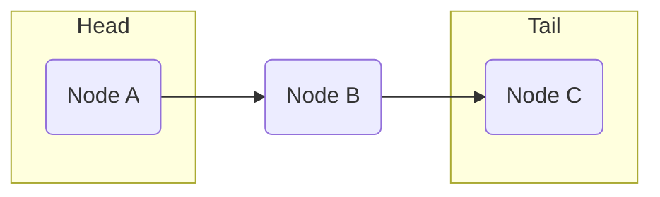
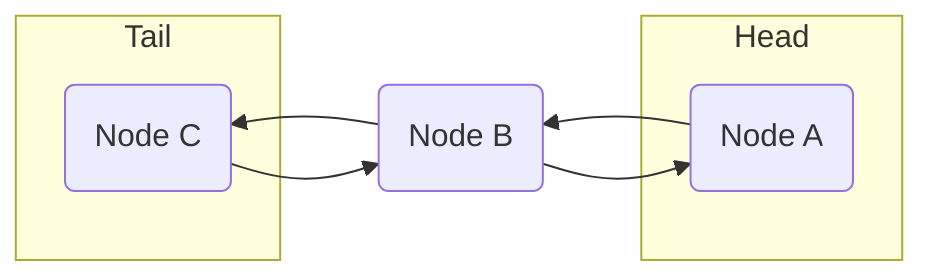

* TOC
{:toc}

J'ai une angoisse dans la vie : les tests techniques. Les codingame, les leetcode, on m'a pas appris à farmer ça en formation. On avait fait un peu d'initiation à l'algorithmie ça m'avait fait chialer.

En revanche, j'ai constaté que dans ces exos, c'était un peu toujours les mêmes concepts qui revenaient : les data structures.

Alors je me suis dis que j'avais plus le choix, je dois repartir de zéro et tout revoir pour me sortir de cette frustration du : "si vous ne savez pas faire ça, vous êtes un(e) mauvais(e) développeur(se)" pour ne pas citer le TiboInShape du dev.

Pour m'aider, j'ai choisi le cours codecademy : [Pass the Technical Interview with Java](https://www.codecademy.com/learn/paths/pass-the-technical-interview-with-java)

# Linear Data Structures

La recherche linéaire est sans doute la plus connue et la plus simple. Elle consiste à parcourir un tableau de données et à comparer chaque élément avec la valeur recherchée.

Imaginez que vous ayez une liste de toutes les séries et films que vous avez regardé sur Netflix ou autres. 
* Si le film que vous cherchez est en haut de votre liste, la recherche va être rapide. 
* Si le film que vous cherchez est en bas de votre liste, la recherche va être potentiellement beaucoup plus longue en fonction de la taille de votre liste. Si vous êtes comme moi grand consommateur de séries, ça peut être très très long.
* Si le film que vous cherchez n'est pas dans votre liste, vous allez devoir parcourir toute votre liste pour vous en rendre compte.

En conclusion, la recherche linéaire va être plus ou moins efficace en fonction de la taille de votre liste et de la position de l'élément recherché dans cette liste.

Pour pouvoir réaliser cette recherche, on va s'appuyer sur des structures de données linéaires.

Ces structures de données linéaires sont des listes de données qui sont organisées de manière linéaire, c'est-à-dire que chaque élément est relié à un autre élément. Ces éléments sont en général appelés des noeuds (nodes).

Ces noeuds sont reliés entre eux par des liens (links) qui permettent de naviguer d'un noeud à un autre.

On va voir ci-dessous les différentes structures de données linéaires que l'on peut utiliser pour réaliser une recherche linéaire.

## Single Linked Lists

La liste chaînée est la structure la plus classique. Il s'agit d'une structure de données linéaire qui est composée de noeuds. Chaque noeud contient une valeur et un lien vers le noeud suivant dans la liste.

Elle se différencie des listes (Array, List) dans le sens où les éléments n'ont pas de position fixe ou de liens entre eux.

La liste chaînée commence par un noeud de tête (head) qui est le premier noeud de la liste. Chaque noeud est relié au suivant par un lien (link) qui est une référence vers le noeud suivant. Elle se termine par un noeud de fin (tail) qui est le dernier noeud de la liste.

## Doubly Linked Lists

La double liste chaînée, c'est la même chose, mais avec un niveau de difficulté en plus. Chaque noeud un lien vers le noeud suivant et le noeud précédent dans la liste.

## Queues
A queue is a linear collection of nodes that exclusively adds (enqueues) nodes to the tail, and removes (dequeues) nodes from the head of the queue. They can be implemented using different underlying data structures, but one of the more common methods is to use a singly linked list, which is what you will be using for your Queue class. Think of the queue data structure as an actual queue, or line, in a grocery store. The person at the front gets to leave the line first, and every person who joins the line has to join in the back.

## Stacks
Stacks are another data structure with a perfectly descriptive name. Like a queue, a stack is a linear collection of nodes that adds (pushes) data to the head, or top, of the stack. However, unlike a queue, a stack removes data (pops) from the head of the stack. Think of it as a stack of books, where you can only pick up the top book, and add a new book to the top.